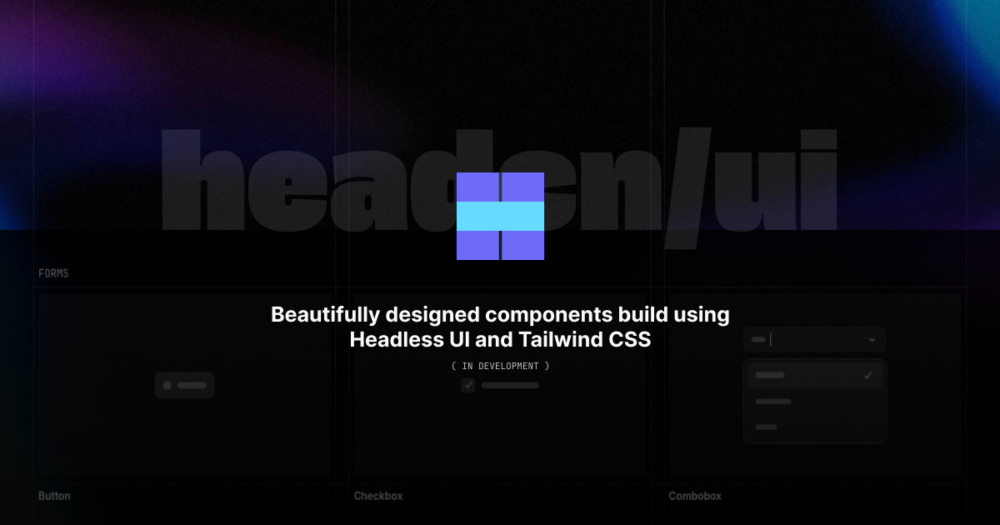

# headcn/ui

> This project is in development and not yet ready for public use.

Beautifully designed and ready to use Headless UI components - with a CLI to add them instantly. **Spend less time on boilerplate, and more time building**.

## Documentation

Visit http://ui.headcn.site/docs to view the documentation.

## Contributing

We welcome contributions!
Please check out our [CONTRIBUTING.md](./CONTRIBUTING.md) for guidelines on how to get started.

If you find this project interesting, please give it a ⭐
Your support inspires us to improve and grow the project.
